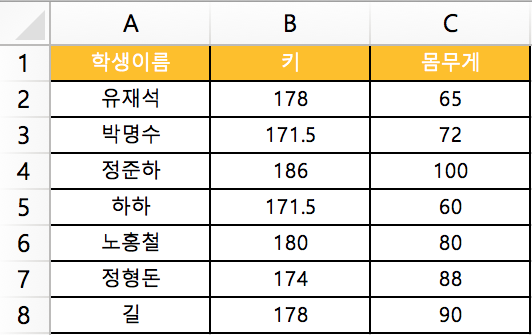

```{r include=F}
# global option
knitr::opts_chunk$set(
  comment = "##>",
  collapse = T,
  eval = T,
  tidy = F,
  message = F,
  warning = F
)
```
---  

## R 프로그램 소개

- R 프로그래밍 언어(줄여서 R)는 통계 계산과 그래픽을 위한 프로그래밍 언어이자 소프트웨어 환경이다. 뉴질랜드 오클랜드 대학의 로버트 젠틀맨(Robert Gentleman)과 로스 이하카(Ross Ihaka)에 의해 시작되어 현재는 R 코어 팀이 개발하고 있다. (출처: 위키백과) 제가 생각하는 R은 통계 분석 프로그램입니다.

- R 설치는 공식 사이트(http://www.r-project.org/)를 통해 설치가 가능하고, 사용 편의를 위해 RStudio라는 IDE(Integrated Development Environment)를 사용하면 엄청 편리하게 R을 사용할 수 있습니다. 그 외에 Tinn-R, Jupyter, Eclipse를 통해 사용할 수 있습니다. RStudio에서 사용할 수 있는 기능은 스크립트 가독성 관리, 패키지 관리, DB 접속 관리, 시각화 결과 관리, markdown문서 작성, 버전관리 툴(git/SVN) 연결 등 다양하게 사용할 수 있고, 코드를 줄/블록 단위로 실행할 수 있고 단축키도 제공합니다.

- R 프로그램으로 데이터를 분석하려면, 프로그램이 처리하는 데이터의 타입과 구조를 이해하는게 좋습니다. 로컬에 존재하는 데이터 파일을 불러오고 분석 가능한 형태로 전처리하게 됩니다. 또한 분석 방법에 따라 필요한 패키지가 있으면 설치해서 사용하게 됩니다.


## 데이터

- 데이터는 수, 영상, 단어 등의 형태로 된 의미 단위이다. 자료는 질적자료와 양적자료로 구분된다. 질적자료는 수치로 측정이 불가능한 자료이고, 양적자료는 수치로 측정이 가능한 자료이다. (출처: 위키백과) 데이터의 구조를 이해하기 위해서 엑셀을 생각하면 쉬울 것 같습니다. 예를 들어 A학교의 학생들의 키와 몸무게를 조사한 데이터를 기록한다면, 엑셀의 열은 데이터 항목인 키와 몸무게가 되고 행에는 학생들의 이름(혹은 ID)을 입력할 수 있습니다. 엑셀로 이야기한 이유는 DB내에 데이터가 쌓인 구조와 비슷하기 때문에 이해를 돕기 위해서 입니다.




## 데이터 타입

- R에서는 숫자형, 정수형, 문자형 등의 데이터 타입이 존재하고, `str()`, `typeof()`으로 확인 가능합니다. (str에 괄호를 사용한 것은 함수명을 표시하기 위함)

     이름              |  설명                       | 예제 
   :------------------:|:---------------------------:|:-----------------------------------------------------------------------:
   `numeric`/`double`  | 숫자                        | 2, 10.5                                                                  
   `integer`           | 정수                        | 1, 5, 10 (입력시 `L`로 표기)                                             
   `string`            | 문자                        | "a", "b"                                                              
   `logical`           | boolean 값                  | `TRUE` / `FALSE` (`T` / `F`로 사용 가능하고, 숫자형으로 변환 가능 T: 1, F: 0)  
   `complex`           | 복소수                      | 1+3i                                                                    

    ```{r}
    # numeric / double
    str(10.5); typeof(10.5)
    
    # integer
    str(1L); typeof(1L)
    
    # integer
    str(1L); typeof(1L)
    
    # logical
    str(T); typeof(F)
    
    as.numeric(T);sum(T)
    
    # complex
    str(1+3i); typeof(1+3i)
    ```

    * 참고: https://dhaine.github.io/2014-11-06-fmv/novice/epi/01-data-structures.html
    

## 데이터 구조

- R에서 데이터 구조는 차원(Dimension)에 따라 아래와 같이 구분합니다. 여기서 차원은 데이터 입력 형태인데 1개 행(또는 열)이 있는 경우 1차원이라하고 행과 열이 있는 경우를 2차원이라 이해하시면 됩니다.

    + `Homogeneous`: 동일한 데이터 타입만 할당 가능
    + `Heterogeneous`: 다른 데이터 타입도 할당 가능
    
    Dimension | Homogeneous  | Heterogeneous
    :--------:|:------------:|:--------------:
    `1-d`     | `Vector`     | `List`
    `2-d`     | `Matrix`     | `Data Frame`
    `n-d`     | `Arrary`     |

    * 참고: https://dhaine.github.io/2014-11-06-fmv/novice/epi/01-data-structures.html


- `Vector`
    
    + 가장 기본적인 데이터 구조로 1차원으로 구성
    + 복수의 원소를 할당 할 때 동일한 타입만 할당 가능
    + `c()`: 복수의 원소를 할당할 수 있음
    + `length()`: 벡터의 원소 갯수를 출력하는 함수

    ```{r}
    # vector
    v <- c(1, 2, 3)
    v
    length(v)
    
    # structure
    str(v)
    ```


- `Matrix`
    
    + 2차원의 데이터 구조(사각 행렬)로 2개 이상 `Vector`의 결합으로 구성
    + 복수의 `Vector`를 할당 할 때 동일한 타입만 할당 가능
    + `ncol`, `nrow` 옵션: `Matrix` 생성할 때 column의 수나 row의 수 지정 가능
    + `byrow`: 데이터 입력 순서를 지정하는 것으로 column 기준은 `F`, row기준은 `T`로 설정 가능(기본값: `F`)
    + `dim()`: 데이터 구조의 차원 표시 (출력 형태: `c(nrow, ncol)`)
    + `cbind()`, `rbind()`: `Vector`의 결합으로 `Matrix`를 생성할 때 사용 (`Data Frame` 도 가능)

    ```{r}
    # matrix
    (m1 <- matrix(c(1, 2, 3, 4), ncol = 2))
    dim(m1)
    
    (m2 <- matrix(c(1, 2, 3, 4), 2, byrow = T))
    
    # structure
    str(m1)
    
    # cbind & rbind
    cbind(c(1, 2), c(3, 4))
    rbind(c(1, 2), c(3, 4))
    ```


- `Array`
    
    + 2차원 이상의 데이터 구조로 `Matrix`가 여러 개의 방으로 구성된 것과 같음
    + 복수의 `Matrix`를 할당 할 때 동일한 타입만 할당 가능

    ```{r}
    # array
    (a <- array(1:24, c(3, 4, 2)))
    dim(a)
    
    # structure
    str(a)
    ```


- `List`
    
    + 2차원 이상의 데이터 구조로 `Vector`가 여러 개의 방으로 구성된 것과 같음
    + 복수의 `Vector`를 할당 할 때 다른 타입도 할당 가능 (`Matrix`는 동일한 타입만 가능)

    ```{r}
    # list
    (l <- list(name = c("samsung", "apple", "LG"), 
               phone = c("Galaxy Note 8", "iPhone X", "LG V30"), 
               age = c(1, 2, 3)))
    
    # structure
    str(l)
    ```


- `Data Frame`
    
    + 2차원의 데이터 구조로 2개 이상 `Vector`의 결합으로 구성 (테이블 형태로 저장하여 데이터 분석에 가장 적절한 형태)
    + 복수의 `Vector`를 할당 할 때 다른 타입도 할당 가능
    
    ```{r}
    # Data Frame
    (df <- data.frame(name = c("samsung", "apple", "LG"), 
                      phone = c("Galaxy Note 8", "iPhone X", "LG V30"), 
                      age = c(1, 2, 3)))
    dim(df)
    
    # structure
    str(df)
    ```


- `Factor`
    
    + `Vector`의 일종으로 범주형 변수를 저장할 때 사용
    + `levels()`: 범주를 생성할 수도 있고, `Factor`의 범주를 확인할 수 있음
    
    ```{r}
    # Data Frame
    (f <- factor(c("samsung", "apple", "LG", "apple", "LG", 
                   "apple", "LG", "apple", "apple", "apple")))
    levels(f)
    
    # structure
    str(f)
    ```


- [참고] 기타 값들

    + `Inf`: 무한대(Infinity), `NAN`: 숫자 아님(Not a number), `NA`: 널 값(Null value) 존재

    ```{r}
    # Inf, NAN, NA
    1/0; 1/Inf
    0/0
    c(1, 2, 3, NA)

    ```


## 데이터 슬라이싱 (자르기)

- 각 데이터 구조에서 데이터 원소에 접근 하는 것

    + 대괄호는 데이터 슬라이싱, 괄호는 함수를 의미

    ```{r}
    # vector
    v
    
    v[1]
    
    v[-1]
    
    # matrix
    m1
    
    m1[1, ]
    
    m1[, 1]
    
    m1[1, 1]
    
    # array
    a
    
    a[, , 1]
    
    a[1, , 1]
    
    # df
    df
    
    df$name
    
    df[, 1]

    ```


## 주요 함수

- 함수: 어떤 데이터를 입력했을 때 출력 값이 나오는 것

    + 괄호를 사용하면 모두 함수
    + 새로운 함수를 만들 때는 `function()`를 사용. 출력값을 지정할 때는 `return()` 사용
    + 아래 코드에서 `word`는 함수의 옵션 값이고, `word`에 "hello world"를 기본 값으로 할당
    
    ```{r}
    # function
    func <- function(word = "hello world"){
        print(word)
    }
    
    # function 실행
    func()
    func(word = "hello world!!!!")
    
    # structure
    str(func)
    ```


- 도움말: `help`, `?`

    + 함수에 대한 설명, 리턴 값, 샘플 코드 제공
    
    ```{r, eval = F}
    ?sum
    ?summary
    ```


- 데이터 타입 확인 / 변환: `is.??()`, `as.??()`

    + `is.??(vector)`: `Vector`의 데이터 타입이 ??가 맞는지 `logical` 타입 결과 출력
    + `as.??(vector)`: `Vector`의 데이터 타입을 ??로 변경
    
    ```{r}
    # numeric, integer, character
    is.numeric(1)
    is.character(1)
    
    as.integer(1.4)
    as.character(1.4)
    
    # factor
    dat <- c("a", "b")
    is.factor(dat)
    
    dat <- as.factor(dat)
    is.factor(dat)
    ```

- 순차 / 반복 데이터 함수: `seq()`, `rep()`, `strrep()`

    + `seq()`: sequence의 약자로, 순차적인 숫자 벡터 생성 (by 옵션: 숫자 간격 설정, 기본값은 1)
    + `rep()`: replicate의 약자로, 반복적인 숫자/문자 벡터 생성 (times 옵션: 전체 벡터 반복 횟수, each 옵션: 벡터의 각 요소 반복 횟수, 기본값은 times)
    + `strrep()`: 반복적인 문자 벡터 생성
    
    ```{r}
    # seq function
    seq(1, 5)
    seq(1, 8, by = 2)
    
    # rep function
    rep(5, 5)
    rep("a", 5)
    
    rep(1:3, times = 5)
    rep(1:3, each = 5)
    
    # strrep function
    strrep("X", 3)
    ```
    
    
- 비교연산자

    + 비교 결과를 `logical` 타입으로 결과 출력
    
    ```{r}
    1 == 2
    1 != 2
    1 >= 2
    1 <= 2
    1 < 2
    1 > 2
    ```


- 산술연산자

    + 덧셈, 뺄셈, 곱셈, 나눗셈, 몫, 제곱, 루트 계산 가능
    + 벡터/매트릭스 연산은 동일 크기일 경우 동일 위치 값 연산
    
    ```{r}
    # 덧셈
    1 + 2
    
    # 뺄셈
    1 - 2
    
    # 곱셈
    1 * 2
    
    # 나눗셈
    1 / 2
    
    # 나머지
    1 %% 2
    
    # 몫
    1 %/% 2
    
    # 제곱
    1^2; 1**2
    
    # 루트
    sqrt(2)
    
    # 벡터 연산
    c(1, 2, 3) + c(2, 3, 5)
    
    # 메트릭스 연산
    matrix(c(1, 2, 3, 4), 2) + matrix(c(2, 5, 4, 7), 2)
    
    ```


- 요약값: `summary()`, `table()`

    + `summary()`: 숫자형 벡터 요약 (출력값: 최소값, 1사분위수, 중위값, 평균, 3사분위수, 최대값)
    + `table()`: 범주형 벡터의 범주별 건수 요약


    ```{r}
    # summary()
    
    aa <- c(1:50)
    summary(aa)
    
    # table()
    cc <- c("a", "a", "a", "a", "b", "b", "b", "c")
    table(cc)
    ```


- 조건문 / 반복문: `if(조건){실행문}`, `for(반복조건){실행문}`, `ifelse(조건, Yes값, No값)`

    + `if(조건){실행문}`: 일반적인 프로그램의 조건문
    + `for(반복조건){실행문}`: 일반적인 프로그램의 반복문
    + `ifelse(조건, Yes값, No값)`: 조건에 맞으면 Yes값 출력, 아니면 No값 출력
    
    ```{r}
    aa <- 1
    
    # if
    if(aa == 1){
       print("aa는 1이다!")
    } else{
       "aa는 1이 아니다!"
       }
    
    # for
    for(i in 1:5){
       print(i)
    }
    
    # 반복문으로 벡터에 데이터 넣기
    
    ## 변수 초기화 
    # aa <- c()
    aa <- rep(NA, 5)
    for(i in 1:5){
       aa[i] <- 3*i
    }
    aa
    
    
    # ifelse(): 2의 배수이면 2를 곱하고 아니면 0 출력
    aa <- c(1:5)
    ifelse(aa%%2 == 0, aa*2, 0)
    ```

## 데이터 불러오기

- 작업공간 함수: `getwd()`, `setwd()`

    + `getwd()`: 현재 작업공간 출력
    + `setwd()`: 작업공간 변경
    + RStudio: 파일 위치로 작업공간 변경 (Session > Set Working Directory > To Source File Location)

    ```{r}
    getwd()
    
    #setwd("D:/...")
    ```


- 외부데이터 불러오기: `read.csv()`, `head()`

    + 외부데이터는 csv, txt, xlsx, sas파일, spss파일 등등을 불러올 수 있지만, 여기에서는 csv 파일을 사용
    + `read.csv()`: csv 파일 불러오는 함수    
    (`header` 옵션: 첫 행이 데이터의 열이름인 경우 `T`로 설정(기본값은 `T`)    
    `file` 옵션: 데이터 위치는 직접 표현 가능("d:\\...\\abc.csv")하고, 작업공간에 데이터가 있는 경우 작업공간 이하 위치만 표기 ("data\\abc.csv")
    + `head()`: 데이터 앞에서 6개 행이 출력 (반대로 `tail`함수는 뒤에서 6개 행이 출력)
    + `read.csv()`는 base 함수도 사용하지만, `readr` 패키지의 `read_csv()`함수나 `data.table` 패키지의 `fread()`함수도 사용
    + [참고] 데이터 출처: https://www.kaggle.com/uciml/iris/data
    
    ```{r}
    # header = T
    iris_raw <- read.csv("../data/Iris.csv", header = T)
    head(iris_raw)
    
    # header = F: 첫행에 header 값이 들어감
    head(read.csv("../data/Iris.csv", header = F))
    ```


## 데이터 전처리 (`dplyr` 패키지)

- 전처리는 데이터를 분석하기 좋은 형태로 만드는 것
    
    + 데이터 추출, 파생변수 생성, 결측지 처리, 이상치 처리 등
    + 관련 패키지: `dplyr`
    
- `dplyr` 패키지
    
    + `dplyr`은 `Data Frame`에서 동작 (`tibble`도 `Data Frame`임)
    + 주요 함수들: `select()`, `filter()`, `mutate()`, `rename()`, `group_by()`, `summarise()`, `arrange()`, `ungroup()`, `%>%`, `rowwise()`
    

- `select()`, `filter()`, `mutate()`, `rename()`
    
    + `select()`: 순서에 맞게 열이름에 해당하는 열만 추출 (sql문의 select 역할)
    + `filter()`: 조건에 맞는 행을 추출 (sql문의 where 역할)
    + `mutate()`: 파생변수 생성 함수로 열의 합이나 window function이 가능 (sql문의 select 역할)
    + `rename()`: 열이름 변경 (바꿀 열이름 = 기존 열이름)

    ```{r}
    library(dplyr)
    
    # select(): 해당 열 추출
    head(select(iris, Sepal.Length), 3)
    
    # select(): 해당 열을 제외하고 추출
    head(select(iris, -Sepal.Length), 3)
    
    # filter(): Sepal.Length가 6이상인 행 추출
    head(filter(iris, Sepal.Length >= 6), 3)
    
    # mutate(): mean_length 추가
    head(mutate(iris, mean_length = (Sepal.Length + Petal.Length) / 2), 3)
    
    # mutate(): window function 사용
    head(mutate(iris, row_num = row_number()), 3)
    
    # rename(): Petal.Length을 petal_length으로 변경
    head(rename(iris, petal_length = Petal.Length), 3)
    ```


- `group_by()`, `summarise()`, `arrange()`, `ungroup()`, `rowwise()`

    + `group_by()`: 그룹 연산을 위해, 그룹으로 생성할 열을 지정 (sql문의 group by 역할)
    + `ungroup()`: 그룹 연산 후 그룹을 해제할 때 사용 (pipe line을 사용할 때 주로 사용)
    + `summarise()`: 그룹 연산에서 생성할 통계량 입력 (sql문의 select 역할 - count(), sum() 등)
    + `arrange()`: 어떤 열에 대한 정렬 (sql문의 order by 역할)
    + `rowwise()`는 전체 행을 group by를 하는 것 (`do()`문장을 활용할 수 있음)

    ```{r}
    library(dplyr)
    
    # `group_by()`
    head(group_by(iris, Species), 3)
    
    # `ungroup()`
    head(ungroup(group_by(iris, Species)), 3)
    
    # `group_by()`, `summarise()`
    head(summarise(group_by(iris, Species), mean_sepal_length = mean(Sepal.Length), n = n()))
    
    # arrange(): 오름차순 정렬
    head(arrange(iris, Sepal.Length), 3)
    
    # arrange(): 내림차순 정렬
    head(arrange(iris, desc(Sepal.Length)), 3)
    
    # length 열들의 각 행별 최소값, 최대값, 평균, 중앙값 계산: group_by() 사용
    iris %>% 
        head(3) %>% 
        group_by(1:n()) %>% 
        mutate(min_length = min(Sepal.Length, Petal.Length),
               max_length = max(Sepal.Length, Petal.Length),
               mean_length = mean(Sepal.Length, Petal.Length),
               median_length = median(Sepal.Length, Petal.Length))
    
    # length 열들의 각 행별 최소값, 최대값, 평균, 중앙값 계산: rowwise() 사용
    iris %>% 
        head(3) %>% 
        rowwise() %>% 
        mutate(min_length = min(Sepal.Length, Petal.Length),
               max_length = max(Sepal.Length, Petal.Length),
               mean_length = mean(Sepal.Length, Petal.Length),
               median_length = median(Sepal.Length, Petal.Length))
    ```


- `%>%`(pipe operator)
    
    + pipe operator은 `dplyr`패키지의 함수들을 연결하여 추출 순서대로 쉽게 코드 작성이 가능하게 함
    + RStudio의 단축키로 Windows: `Ctrl+Shift+m`, Mac: `Cmd+Shift+M`
    + pipe operator으로 연결되었을 때 data 부분은 "."으로 표현되는데 이 의미는 앞의 데이터 처리 결과를 표현함

    ```{r}
    iris %>% 
        filter(Sepal.Length >= 6) %>% 
        mutate(mean_length = (Sepal.Length + Petal.Length) / 2) %>% 
        select(-Sepal.Length) %>% 
        head(3)
    ```


- `do()`

    + `do()`는 pipe operator으로 연결된 데이터에 특정 함수를 적용이 가능하도록 함
    
    ```{r}
    # do()
    iris %>% 
        group_by(Species) %>%
        do(sl_range = range(.$Sepal.Length)) %>%
        summarise(Species, sl_range = sprintf("%.1f-%.1f", sl_range[1], sl_range[2]))
    
    # do()와 동일한 결과
    iris %>% 
        group_by(Species) %>%
        summarise(sl_range = sprintf("%.1f-%.1f", range(Sepal.Length)[1], range(Sepal.Length)[2]))
    
    # do() 문장에 lm() 사용
    library(broom)
    mtcars %>%
        group_by(cyl) %>%
        do(mod = lm(mpg ~ vs, data = .)) %>% 
        tidy(mod)
    
    # do() 문장에 lm() 사용
    mtcars %>%
        group_by(cyl) %>%
        do(mod = lm(mpg ~ vs, data = .)) %>% 
        glance(mod)

    
    ```

    + 참고: http://stat545.com/block023_dplyr-do.html


## [참고] RStudio 주요 단축키

- RStudio를 편리하게 사용하기 위해 단축키 제공
    
     내용                              |  Window               | Mac 
   :----------------------------------:|:---------------------:|:-------------------------:
   Insert chunk (Sweave and Knitr)     | `Ctrl+Alt+I`          | `Command+Option+I`
   Run current line/selection          | `Ctrl+Enter`          | `Command+Enter`
   Undo                                | `Ctrl+Z`              | `Command+Z`
   Redo                                | `Ctrl+Shift+Z`        | `Command+Shift+Z`
   Cut                                 | `Ctrl+X`              | `Command+X`
   Copy                                | `Ctrl+C`              | `Command+C`
   Paste                               | `Ctrl+V`              | `Command+V`
   Select All                          | `Ctrl+A`              | `Command+A`
   Insert assignment operator          | `Alt+-`            | `Option+-`
   Insert pipe operator                | `Ctrl+Shift+M`        | `Cmd+Shift+M`                                         

    + 더보기: https://support.rstudio.com/hc/en-us/articles/200711853-Keyboard-Shortcuts

